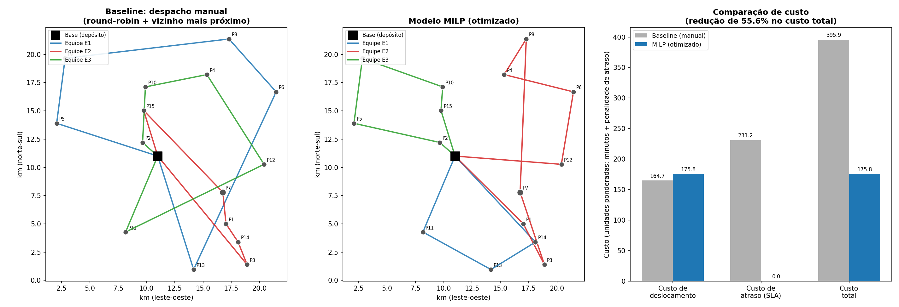

# Otimização de Roteirização de Equipes de Campo (MILP)

Projeto de portfólio em Programação Linear Inteira Mista (MILP) aplicada a um
problema clássico de operações: alocar e sequenciar atendimentos de campo entre
equipes técnicas, minimizando deslocamento e atraso em relação a prazos de
atendimento (SLA), sujeito a restrições de jornada de trabalho.

**Autor:** Guilherme Miranda — [linkedin.com/in/guilherme-miranda-ltda](https://www.linkedin.com/in/guilherme-miranda-ltda/) · [github.com/guilhermeMirandaLtda](https://github.com/guilhermeMirandaLtda)

> **Sobre os dados:** todos os dados usados neste projeto são **sintéticos**,
> gerados por distribuição aleatória com seed fixa (`src/data_generator.py`).
> O cenário é inspirado, em termos de estrutura do problema, no setor de
> distribuição de energia elétrica (atendimentos de campo: manutenção,
> inspeção, instalação, emergência) — nenhum dado real ou confidencial de
> nenhuma empresa é utilizado em nenhum momento.

## Por que este projeto

Este projeto foi construído para aprofundar, de ponta a ponta, uma competência
específica: modelagem de problemas de otimização combinatória (programação
linear inteira / inteira mista) aplicados a um problema de negócio real do
setor industrial — área em que minha experiência de 17+ anos em uma
distribuidora de energia me dá contexto de domínio genuíno, mesmo sem
experiência profissional prévia formal em otimização matemática.

## O problema de negócio

Uma operação com equipes de campo (ex.: concessionária de energia, empresa de
manutenção industrial, telecom) recebe diariamente uma lista de atendimentos
distribuídos geograficamente — cada um com um tipo de serviço, uma prioridade
(emergencial, preventiva, instalação, inspeção) e um prazo desejado de
atendimento. Sem apoio analítico, o despacho tende a seguir regras simples
(ordem de chegada do chamado, distribuição arbitrária entre equipes), o que
gera deslocamento desnecessário e atrasos em atendimentos prioritários.

**Pergunta de otimização:** dado um conjunto de pontos de atendimento e um
conjunto de equipes partindo de uma base comum, qual a alocação e sequência de
visitas que minimiza o custo total de deslocamento **e** o atraso ponderado
por prioridade, respeitando a jornada máxima de cada equipe?

## Formulação matemática (resumo)

O problema é uma variante do **Vehicle Routing Problem with Time Windows
(VRPTW)** com janelas de tempo suaves (soft time windows), formulado como
MILP:

- **Variáveis:** `x[i,j,k]` (binária: equipe *k* percorre o arco *i→j*),
  `t[i]` (instante de início do atendimento *i*), `atraso[i]` (atraso em
  relação ao prazo desejado).
- **Objetivo:** minimizar `custo de deslocamento + peso_prioridade × atraso`.
- **Restrições:** cada ponto visitado exatamente uma vez; conservação de
  fluxo por equipe; eliminação de sub-rotas via propagação de tempo (técnica
  análoga à formulação de Miller-Tucker-Zemlin, reaproveitando as variáveis
  de tempo já necessárias para as janelas); jornada máxima por equipe.

A formulação completa, em notação matemática, está no notebook
[`notebooks/analise.ipynb`](notebooks/analise.ipynb) e comentada em detalhe em
[`src/model.py`](src/model.py).

## Metodologia e ferramentas

| Etapa | Ferramenta |
|---|---|
| Geração de dados sintéticos | Python (`numpy`, `pandas`) |
| Formulação e resolução do MILP | `PuLP` + solver `CBC` (open-source) |
| Heurística de comparação (baseline) | vizinho mais próximo + round-robin |
| Visualização | `matplotlib` |

O solver foi executado com limite de tempo de 300 segundos — prática padrão em
otimização aplicada, já que VRPTW é NP-difícil e a prova de otimalidade exata
pode ser inviável em tempo hábil para instâncias maiores. O resultado reporta
o **gap de otimalidade** (diferença entre a melhor solução encontrada e o
limite inferior comprovado), em vez de assumir otimalidade sem verificação.

## Resultados

Instância de referência: 15 pontos de atendimento, 3 equipes, base única.

| Métrica | Baseline (despacho manual) | MILP (otimizado) |
|---|---:|---:|
| Custo de deslocamento | 164.7 | 175.8 |
| Custo de atraso (SLA) | 231.2 | 0.0 |
| **Custo total** | **395.9** | **175.8** |
| Gap de otimalidade | — | 0.09% (300s) |

**Redução de 55.6% no custo total**, eliminando por completo os atrasos em
atendimentos prioritários — a um custo de deslocamento apenas ligeiramente
maior que o baseline. Em outras palavras: o modelo não "economiza"
deslocamento a qualquer custo, ele troca uma pequena quantidade de
deslocamento adicional por zero violação de prazos, que é o que realmente
pesa no negócio (SLA, contratos, segurança).



## Limites conhecidos e próximos passos

Sendo direto sobre as limitações — o que, na minha visão, é parte de
apresentar um projeto de otimização com rigor:

- **Escalabilidade:** a formulação MILP exata cresce rápido. Com 15 pontos e
  3 equipes o solver já precisa de ~300s para fechar o gap a <0.1%; para
  centenas de pontos, a abordagem correta em produção seria trocar o MILP
  exato por uma metaheurística ou por um solver especializado em roteirização
  (ex.: Google OR-Tools Routing, que combina heurísticas construtivas com
  busca local). Este projeto prioriza mostrar a formulação exata porque é o
  que evidencia entendimento matemático do problema — mas a escolha de
  ferramenta em produção dependeria da escala real.
- **Depósito único:** o modelo assume uma base central. Múltiplos depósitos
  regionais exigiriam adaptar as restrições de fluxo.
- **Sem restrição de especialização:** todas as equipes são tratadas como
  intercambiáveis. Em um cenário real, nem toda equipe está habilitada para
  todo tipo de atendimento (ex.: emergências de alta tensão exigem
  certificação específica) — isso entraria como uma restrição adicional de
  compatibilidade equipe-tarefa.
- **Janelas suaves, não rígidas:** o modelo permite atraso mediante
  penalidade. Para atendimentos com prazo regulatório inegociável, o correto
  seria modelar como janela de tempo rígida (hard constraint).

## Como executar

```bash
python -m venv .venv && source .venv/bin/activate
pip install -r requirements.txt

cd src
python data_generator.py      # gera os dados sintéticos em data/
python model.py                # roda uma instância pequena de teste (sanity check)
python baseline.py             # roda a heurística de comparação
python visualize.py            # gera os gráficos em outputs/
```

Ou abra [`notebooks/analise.ipynb`](notebooks/analise.ipynb) para o passo a
passo completo com explicação e resultados já computados.

## Estrutura do projeto

```
otimizacao-roteirizacao-equipes/
├── README.md
├── requirements.txt
├── src/
│   ├── data_generator.py   # geração de dados sintéticos
│   ├── model.py             # formulação e resolução do MILP (PuLP/CBC)
│   ├── baseline.py          # heurística de comparação
│   ├── visualize.py         # visualizações
│   └── build_notebook.py    # script que gera o notebook com outputs
├── data/                    # dados sintéticos gerados (CSV)
├── outputs/                 # gráficos e resumo de resultados (JSON)
└── notebooks/
    └── analise.ipynb        # notebook end-to-end com resultados
```
